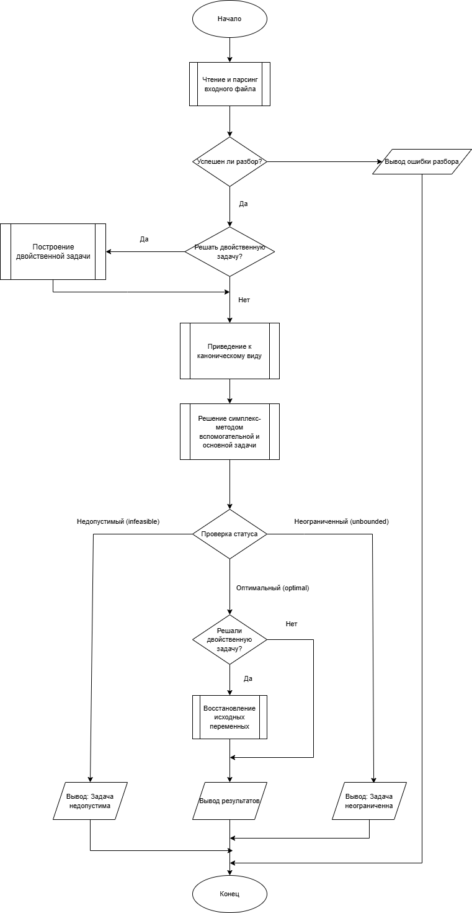
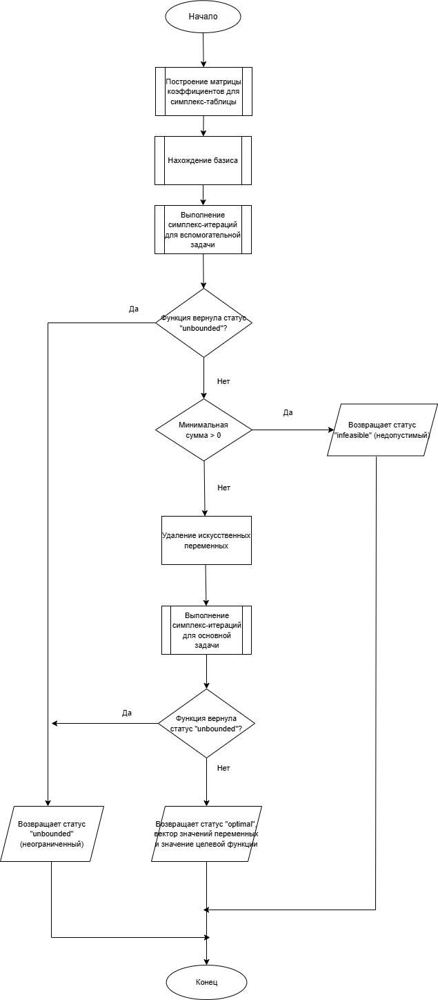
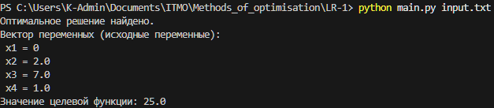
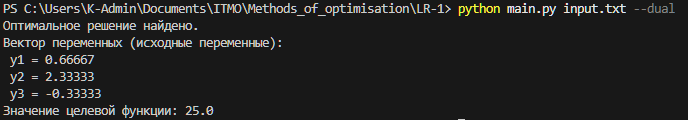
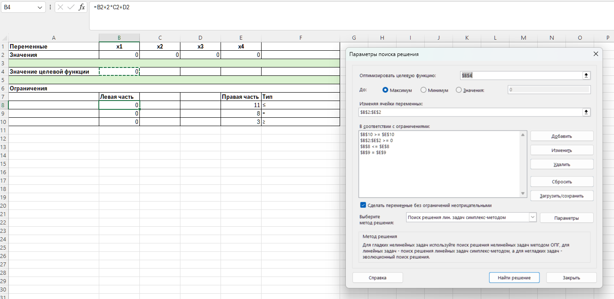
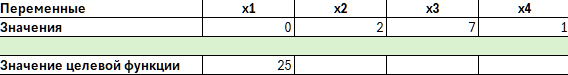

**ФИО:** Генне Константин Валерьевич  
**Поток:** МЕТОПТ 1.1

## 1. Описание алгоритма решения ЗЛП
Программа предназначена для решения задачи линейного программирования симплекс-методом.  
Реализованы этапы:
1. Считывание задачи из текстового файла.
2. Приведение к каноническому виду:
   - Все ограничения — равенства.  
   - Правые части неотрицательны.  
   - Все переменные неотрицательны (при необходимости выполняется замена переменных).
3. Формирование вспомогательной задачи.
4. Решение вспомогательной задачи симплекс-методом.
5. Переход к основной задаче с найденным базисом.
6. Решение основной задачи симплекс-методом.
7. Вывод результата:
   - Оптимальный план (вектор значений переменных).
   - Значение целевой функции.
   - Сообщение о несовместности или неограниченности, если решение отсутствует.


### Блок-схема программы  



**Детализация процесса решения симплекс-методом вспомогательной и основной задачи на уровне функции two_phase_solve**  



## 2. Инструкция по установке

**Требования:** Python 3.8 или новее.


**Шаг 1 — склонировать этот репозиторий в рабочую папку**

```
git clone https://github.com/KosGeny/ITMO_Optimization_Methods
```

И перейти в эту папку.

**Шаг 2 — (опционально) создать виртуальное окружение**

Linux / macOS:

```
python3 -m venv venv
source venv/bin/activate
```

Windows (PowerShell):

```
python -m venv venv
.\venv\Scripts\Activate.ps1
```

**Шаг 3 — убедиться в версии Python**

```
python --version
```


**Шаг 4 — запустить программу**

Режимы:

Решение прямой задачи (по умолчанию):
```
python simplex.py <название файла с условием задачи>
```

Решение двойственной задачи:
```
python simplex.py <название файла с условием задачи> --dual или python simplex.py <название файла с условием задачи> -d
```

Формат входного файла (input.txt):
```
max: 3 2
1 1 <= 4
1 2 <= 6
vars: x1>=0 x2>=0
```

Правила:
- Первая непустая строка после комментариев: max: или min: и коэффициенты целевой функции (через пробел).
- Далее — ограничения в виде: a1 a2 ... (<= | >= | =) b.
- Опционально в конце строка vars: с указанием знаков переменных (например x1>=0 x2 free x3<=0). Если не задано — предполагается >=0.


## 3. Демонстрация работы
Вариант задания: 9

Максимизировать 'Z = 2*x_1 + x_2 + 3*x_3 + 2*x_4  
при условиях:  
x_1 + 2*x_2 + x_3 <= 11  
x_1 + x_3 + x_4 = 8  
x_2 + x_4 >= 3

### Примеры запусков
**Решение ЗЛП**  



**Решение двойственной задачи**  



Оба решения являются верными.

### Сравнение результата с MS Excel
В MS Excel было введено условие исходной задачи. Для расчёта использована надстройка "Поиск решения".



В результате были получены те же значения, что и ранее давала программа. Значит, программа работает корректно.




## 4. Рефлективный вывод
Справиться с заданием было непросто. С наибольшими проблемами я столкнулся на этапе приведения задачи к каноническому виду, а также при работе с разными типами переменных и ограничений. Постоянно приходилось отлаживать код, выводить промежуточные результаты и искать ошибки в знаках. Не менее сложной задачей стала реализация двойственной задачи, логика которой далась не сразу.  
В целом, задание, безусловно, полезно для глубокого погружения в тему, но его отладка отнимает много времени. Это лишний раз доказывает, что в реальной работе эффективнее применять готовые проверенные библиотеки.
