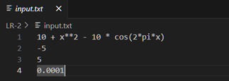
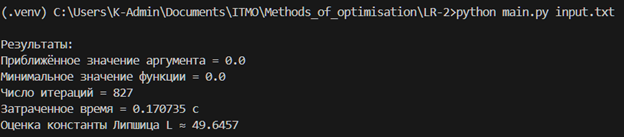
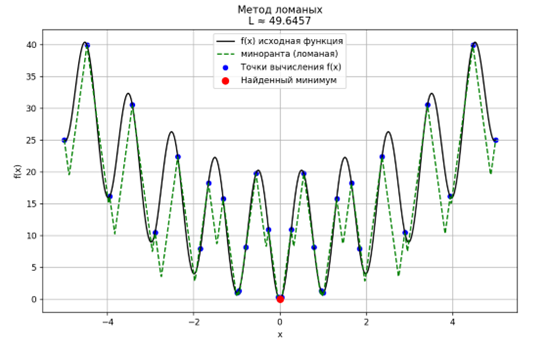

**ФИО:** Генне Константин Валерьевич  
**Поток:** МЕТОПТ 1.1

## 1. Входные данные
Входные данные для программы помещаются в текстовый файл со следующей структурой:  
- Первая строка – рассматриваемая Липшицева функция;  
- Вторая строка – значение левого конца отрезка;  
- Третья строка – значение правого конца отрезка;  
- Четвёртая строка – точность вычисления (константа eps).  

## 2. Запуск программы
Запуск программы осуществляется через командную строку или терминал. Необходимо предварительно перейти в директорию, в которой расположены файл программы и текстовый файл с входными данными.  
```
python main.py <название текстового файла>
```

## 3. Демонстрация работы программы
  

  

  
