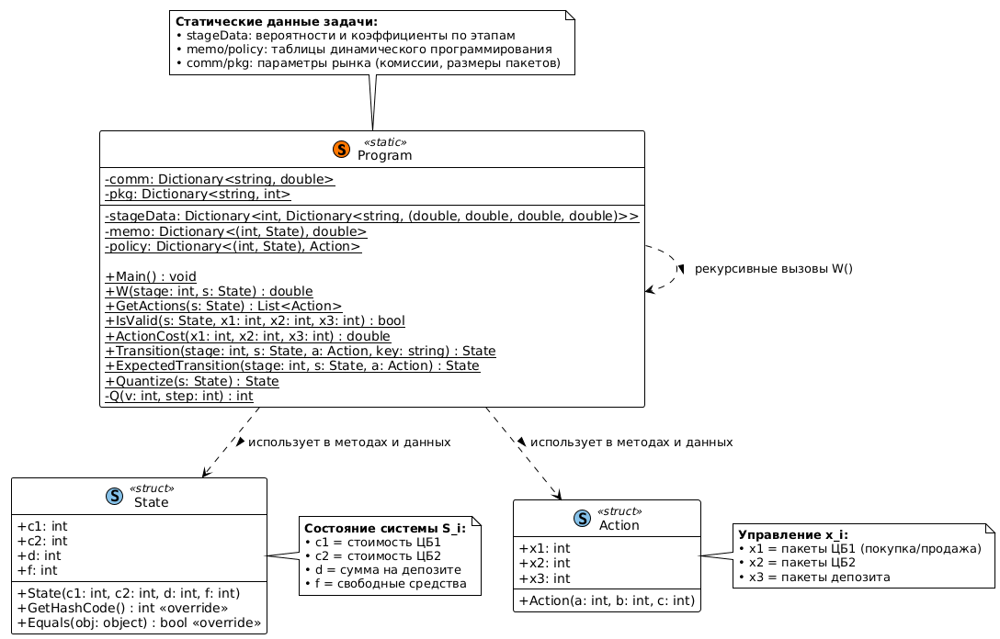
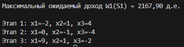

# Отчёт по лабораторной работе "Решение задачи динамического программирования"

**ФИО**: Генне Константин Валерьевич  
**ПОТОК**: МЕТОПТ 1.1

**Цель работы**:  
Целью данной работы является разработка и реализация оптимальной стратегии пошагового управления инвестиционным портфелем в условиях стохастической неопределенности с использованием метода динамического программирования и критерия Байеса.  

**Постановка задачи**:  
К началу периода планирования у инвестора было два вида ценных бумаг (ЦБ) и депозиты (Деп.) на сумму 100, 800, 400 денежных единиц (д.е.) соответственно. В общих чертах говоря, Деп. – банковские вклады; при этом условия на все депозиты одинаковые. Также в инвестора есть свободные средства в размере 600 д.е. Excel версия данных находится в приложенном файле.

Период планирования разбит на три этапа. Для каждого этапа известны вероятности наступления ситуации, которая может быть «благоприятной», «нейтральной», «негативной» (обратите внимание, что вероятности событий в каждом этапе разные).

В зависимости от ситуации оценены изменения стоимости ценных бумаг и процентная ставка депозита. Данные приведены в таблице. Например, на первом этапе при реализации негативной ситуации (ее вероятность равна 0,1 или 10%) курс ЦБ1 понизится на 20%, а Деп. не будет иметь дохода (коэффициент равен единице); или на этапе №2 при благоприятной ситуации (вероятность – 30%) ЦБ2 повысится на 15%, а Деп. даст доход в один процент; при нейтральной ситуации в третьем этапе (вероятность – 40%) – депозит даст доход один процент от суммы за один период.

| Ситуация | ЭТАП №1 |         |         |         | ЭТАП №2 |         |         |         | ЭТАП №3 |         |         |         |
|----------|---------|---------|---------|---------|---------|---------|---------|---------|---------|---------|---------|---------|
|          | Вероят. | ЦБ1     | ЦБ2     | Деп.    | Вероят. | ЦБ1     | ЦБ2     | Деп.    | Вероят. | ЦБ1     | ЦБ2     | Деп.    |
| Благопр. | 0,60    | 1,20    | 1,10    | 1,07    | 0,30    | 1,4     | 1,15    | 1,01    | 0,40    | 1,15    | 1,12    | 1,05    |
| Нейтр.   | 0,30    | 1,05    | 1,02    | 1,03    | 0,20    | 1,05    | 1,00    | 1,00    | 0,40    | 1,05    | 1,01    | 1,01    |
| Негатив. | 0,10    | 0,80    | 0,95    | 1,00    | 0,50    | 0,60    | 0,90    | 1,00    | 0,20    | 0,70    | 0,94    | 1,00    |

Шаговым управлением является изменение объема фондов ценных бумаг и(или) депозитов на один или несколько пакетов одну четверть от первоначальной стоимости. Например, перед первым этапом инвестор может купить ЦБ1 в объеме 25 д.е. или продать депозиты в объеме 100 д.е. При увеличении объемов ценных бумаг и депозитов инвестор не может брать кредит, а распоряжаться только свободными средствами.

Требуется разработать такой план управления закупками/продажами ценных бумаг и депозитов, чтобы суммарный объем дохода был максимальным. Поскольку в задаче присутствуют вероятности, то для оценки дохода необходимо использовать критерии принятия решений в условиях неопределенности (при программной реализации Вы можете выбрать один из них, например, критерий Байеса).

Варианты заданий:
1) Составить математическую постановку задачи, выписать рекуррентное соотношение Беллмана, составить и оформить алгоритм решения задачи.
2) Кроме выполнения первого задания выполнить программную реализацию метода и определить наилучшее управление и максимальный доход; критерия принятия решений выбирает пользователь 


## Общая математическая формулировка задачи динамического программирования

- **Этапы**: $i = 1,2,\dots,N$ — номер шага во временном горизонте.
- **Состояние**: $S_i$ — состояние системы перед началом $i$-го этапа.
- **Управление**: $x_i \in X_i(S_i)$ — допустимое управление на этапе $i$.
- **Внешняя ситуация**: $s_i \in \mathcal{S}$ — внешняя ситуация на этапе $i$.
- **Переход состояния**: $S_{i+1} = \phi_i(S_i, x_i, s_i)$.
- **Локальная награда/затрата**: $w_i(S_i, x_i, s_i)$.
- **Целевая функция**: $W(S)$ — совокупная награда (или затраты) на всём горизонте.


**Цель**: выбрать последовательность управлений $x_1, x_2, \dots, x_N$ для оптимизации целевой функции.


## Рекуррентное соотношение Беллмана

**В общем случае**:
$$
W_i(S_i) = \max_{x_i \in X_i(S_i)} \mathbb{E}_s \left[ w_i(S_i, x_i, s) + W_{i+1}\left( \phi_i(S_i, x_i, s) \right) \right],
$$
где $\mathbb{E}_s$ — математическое ожидание по случайной ситуации $s$.

## Алгоритм решения задачи динамического программирования

### Обозначения:
- $i = 1, 2, 3$ - номер этапа.
- $S_i = (c1_i, c2_i, d_i, f_i)$ - состояние системы перед началом $i$-го этапа, где:
  - $c1_i$ - стоимость ЦБ1,
  - $c2_i$ - стоимость ЦБ2,
  - $d_i$ - сумма на депозите,
  - $f_i$ - свободные средства.
- $x_i = (x1_i, x2_i, x3_i)$ - управление на $i$-м этапе ($x1_i, x2_i, x3_i$ - количество пакетов для ЦБ1, ЦБ2 и депозита соответственно).
- $X_i(S_i)$ - множество допустимых управлений для состояния $S_i$.
- $s$ - ситуация на этапе ($s \in \{\text{благоприятная}, \text{нейтральная}, \text{негативная}\}$).
- $p_i(s)$ - вероятность ситуации $s$ на этапе $i$.
- $k1_i(s), k2_i(s), kd_i(s)$ - коэффициенты изменения стоимости активов для ситуации $s$ на этапе $i$.
- $\phi_i(S_i, x_i, s) = S_{i+1}$ - функция перехода состояния.
- $w_i(S_i, x_i, s)$ — локальный (этапный) критерий. Для $i < 3$: $w_i = 0$; для $i = 3$: $w_3 = c1_{4} + c2_{4} + d_{4} + f_{4}$.
- $W_i(S_i)$ — функция Беллмана: максимальное ожидаемое значение целевой функции от этапа $i$ до конца при начальном состоянии $S_i$.
- $W(S) = c1_4 + c2_4 + d_4 + f_4$ — целевая функция (суммарный доход).

**Ограничения на управление $x_i \in X_i(S_i)$:**
1. $c1_i + 25 \cdot x1_i \geq 30$,
2. $c2_i + 200 \cdot x2_i \geq 150$,
3. $d_i + 100 \cdot x3_i \geq 100$,
4. $f_i - \text{cost}(x_i) \geq 0$, где:
   $$
   \text{cost}(x_i) = 
   \begin{cases} 
   25|x1_i| \cdot 1.04 & \text{если } x1_i > 0, \\
   -25|x1_i| \cdot 0.96 & \text{если } x1_i < 0, \\
   0 & \text{если } x1_i = 0,
   \end{cases}
   +
   \begin{cases} 
   200|x2_i| \cdot 1.07 & \text{если } x2_i > 0, \\
   -200|x2_i| \cdot 0.93 & \text{если } x2_i < 0, \\
   0 & \text{если } x2_i = 0,
   \end{cases}
   +
   \begin{cases} 
   100|x3_i| \cdot 1.05 & \text{если } x3_i > 0, \\
   -100|x3_i| \cdot 0.95 & \text{если } x3_i < 0, \\
   0 & \text{если } x3_i = 0.
   \end{cases}
   $$

**Функция перехода $\phi_i(S_i, x_i, s) = S_{i+1}$:**
$$
\begin{aligned}
c1_{i+1} &= (c1_i + 25 \cdot x1_i) \cdot k1_i(s), \\
c2_{i+1} &= (c2_i + 200 \cdot x2_i) \cdot k2_i(s), \\
d_{i+1} &= (d_i + 100 \cdot x3_i) \cdot kd_i(s), \\
f_{i+1} &= f_i - \text{cost}(x_i).
\end{aligned}
$$

**Целевая функция:**
$$
W = \mathbb{E}\left[ c1_4 + c2_4 + d_4 + f_4 \right].
$$

### 1. Обратный ход (вычисление функций $W_i$)

**Цель:**  
Для каждого этапа $i$ и любого состояния $S_i = (c1_i, c2_i, d_i, f_i)$ вычислить:
- $W_i(S_i)$ — максимальное ожидаемое значение дохода от этапа $i$ до конца,
- $x_i^*(S_i)$ — оптимальное управление, максимизирующее это ожидание.

#### **Этап $i = 3$ (последний):**
Для состояния $S_3 = (c1_3, c2_3, d_3, f_3)$:
1. Перебрать все допустимые управления $x_3 = (x1_3, x2_3, x3_3)$, удовлетворяющие ограничениям:
   $$
   \begin{aligned}
   &c1_3 + 25x1_3 \geq 30, \\
   &c2_3 + 200x2_3 \geq 150, \\
   &d_3 + 100x3_3 \geq 100, \\
   &f_3 - \text{cost}(x_3) \geq 0.
   \end{aligned}
   $$
2. Для каждого $x_3$ вычислить математическое ожидание конечного дохода:
   $$
   \mathbb{E}[W_4 \mid x_3] = \sum_{s} p_3(s) \cdot \Big[ 
   (c1_3 + 25x1_3) k1_3(s) + (c2_3 + 200x2_3) k2_3(s) + (d_3 + 100x3_3) kd_3(s) + f_3 - \text{cost}(x_3)
   \Big].
   $$
3. Найти оптимальное управление:
   $$
   x_3^*(S_3) = \arg\max_{x_3} \mathbb{E}[W_4 \mid x_3], \quad W_3(S_3) = \max_{x_3} \mathbb{E}[W_4 \mid x_3].
   $$

#### **Этап $i = 2$:**
Для состояния $S_2 = (c1_2, c2_2, d_2, f_2)$:
1. Перебрать все допустимые $x_2 = (x1_2, x2_2, x3_2)$.
2. Для каждого $x_2$ вычислить мат. ожидание:
   $$
   \mathbb{E}[W_3 \mid x_2] = \sum_{s} p_2(s) \cdot W_3\big( \phi_2(S_2, x_2, s) \big),
   $$
   где $\phi_2(S_2, x_2, s)$ — функция перехода в случайное состояние $S_3$ при сценарии $s$.
3. Оптимальное управление:
   $$
   x_2^*(S_2) = \arg\max_{x_2} \mathbb{E}[W_3 \mid x_2], \quad W_2(S_2) = \max_{x_2} \mathbb{E}[W_3 \mid x_2].
   $$

#### **Этап $i = 1$:**
Аналогично этапу 2. Для начального состояния $S_1 = (100, 800, 400, 600)$:
$$
W_1(S_1) = \max_{x_1} \sum_{s} p_1(s) \cdot W_2\big( \phi_1(S_1, x_1, s) \big).
$$

---

### 2. Прямой ход (детерминированная симуляция оптимальной стратегии)

**Цель:**  
Применить оптимальную стратегию $\{x_1^*, x_2^*, x_3^*\}$ для получения **средней траектории** системы и оценки ожидаемого дохода $W_1(S_1)$.

#### **Ключевой принцип:**  
На прямом ходе вместо генерации случайных сценариев используется **детерминированный переход** через математическое ожидание:
$$
\bar{S}_{i+1} = \mathbb{E}_s \big[ \phi_i(S_i, x_i^*, s) \big] = \sum_{s} p_i(s) \cdot \phi_i(S_i, x_i^*, s).
$$
Это позволяет за один проход вычислить **ожидаемую траекторию** системы под действием оптимальной стратегии.

#### **Этап $i = 1$:**
1. Для $S_1 = (100, 800, 400, 600)$ выбрать управление:
   $$
   x_1^* = x_1^*(S_1) = \arg\max_{x_1} \mathbb{E}_s \big[ W_2(\phi_1(S_1, x_1, s)) \big].
   $$
2. Вычислить усреднённое следующее состояние:
   $$
   \begin{aligned}
   \bar{c1}_2 &= \sum_{s} p_1(s) \cdot (c1_1 + 25x1_1^*) k1_1(s), \\
   \bar{c2}_2 &= \sum_{s} p_1(s) \cdot (c2_1 + 200x2_1^*) k2_1(s), \\
   \bar{d}_2  &= \sum_{s} p_1(s) \cdot (d_1 + 100x3_1^*) kd_1(s), \\
   \bar{f}_2  &= f_1 - \text{cost}(x_1^*).
   \end{aligned}
   $$
3. Обозначить $S_2 = (\bar{c1}_2, \bar{c2}_2, \bar{d}_2, \bar{f}_2)$.

#### **Этап $i = 2$:**
1. Для $S_2$ выбрать управление:
   $$
   x_2^* = x_2^*(S_2) = \arg\max_{x_2} \mathbb{E}_s \big[ W_3(\phi_2(S_2, x_2, s)) \big].
   $$
2. Вычислить усреднённое состояние $S_3 = \mathbb{E}_s \big[ \phi_2(S_2, x_2^*, s) \big]$.

#### **Этап $i = 3$:**
1. Для $S_3$ выбрать управление:
   $$
   x_3^* = x_3^*(S_3) = \arg\max_{x_3} \mathbb{E}_s \big[ W_4(\phi_3(S_3, x_3, s)) \big].
   $$
2. Вычислить финальное состояние:
   $$
   S_4 = \mathbb{E}_s \big[ \phi_3(S_3, x_3^*, s) \big].
   $$
3. Итоговый ожидаемый доход:
   $$
   W = c1_4 + c2_4 + d_4 + f_4.
   $$


## Псевдокод алгоритма
**Основнной алгоритм**
```plaintext
АЛГОРИТМ Основной
    ИНИЦИАЛИЗАЦИЯ:
        - Загрузить данные этапов: stageData[этап][ситуация] = (p, k1, k2, kd)
        - Задать параметры: pkg = {c1:25, c2:200, d:100}, comm = {покупка/продажа: комиссия}
        - Создать пустые таблицы:
            memo: (этап, состояние) → максимальное ожидание
            policy: (этап, состояние) → оптимальное управление

    // 1. ОБРАТНЫЙ ХОД: Вычисление W_i(S_i) и оптимальной стратегии
    ФУНКЦИЯ W(этап, состояние):
        ЕСЛИ этап == 4:
            ВЕРНУТЬ c1 + c2 + d + f  // Граничное условие

        qs = Quantize(состояние)  // Квантование для сокращения размерности
        ЕСЛИ (этап, qs) в memo:
            ВЕРНУТЬ memo[(этап, qs)]

        ЛУЧШЕЕ_ЗНАЧЕНИЕ = -∞
        ЛУЧШЕЕ_УПРАВЛЕНИЕ = (0, 0, 0)

        ДЛЯ КАЖДОГО допустимого управления x = (x1, x2, x3) В GetActions(qs):
            ev = 0  // Математическое ожидание
            ДЛЯ КАЖДОЙ ситуации s В stageData[этап]:
                (p, k1, k2, kd) = stageData[этап][s]
                след_состояние = Transition(этап, qs, x, s)  // φ_i(S_i, x_i, s)
                след_квантованное = Quantize(след_состояние)
                ev += p * W(этап+1, след_квантованное)  // Σ p(s)·W_{i+1}(φ_i(...))

            ЕСЛИ ev > ЛУЧШЕЕ_ЗНАЧЕНИЕ:
                ЛУЧШЕЕ_ЗНАЧЕНИЕ = ev
                ЛУЧШЕЕ_УПРАВЛЕНИЕ = x

        memo[(этап, qs)] = ЛУЧШЕЕ_ЗНАЧЕНИЕ
        policy[(этап, qs)] = ЛУЧШЕЕ_УПРАВЛЕНИЕ
        ЗАПИСАТЬ_В_ЛОГ(этап, qs, ЛУЧШЕЕ_УПРАВЛЕНИЕ, ЛУЧШЕЕ_ЗНАЧЕНИЕ)
        ВЕРНУТЬ ЛУЧШЕЕ_ЗНАЧЕНИЕ

    // 2. ЗАПУСК ОБРАТНОГО ХОДА
    НАЧАЛЬНОЕ_СОСТОЯНИЕ = (c1=100, c2=800, d=400, f=600)
    W1 = W(1, НАЧАЛЬНОЕ_СОСТОЯНИЕ)
    ВЫВЕСТИ "Максимальный ожидаемый доход: " + W1

    // 3. ПРЯМОЙ ХОД: Применение оптимальной стратегии
    ТЕКУЩЕЕ_СОСТОЯНИЕ = НАЧАЛЬНОЕ_СОСТОЯНИЕ
    ДЛЯ этапа ОТ 1 ДО 3:
        x* = policy[(этап, Quantize(ТЕКУЩЕЕ_СОСТОЯНИЕ))]  // Оптимальное управление
        ВЫВЕСТИ "Этап " + этап + ": управление = " + x*

        // Детерминированный переход через матожидание
        ТЕКУЩЕЕ_СОСТОЯНИЕ = ExpectedTransition(этап, ТЕКУЩЕЕ_СОСТОЯНИЕ, x*)
        ТЕКУЩЕЕ_СОСТОЯНИЕ = Quantize(ТЕКУЩЕЕ_СОСТОЯНИЕ)

    ИТОГ = ТЕКУЩЕЕ_СОСТОЯНИЕ.c1 + ТЕКУЩЕЕ_СОСТОЯНИЕ.c2 + ТЕКУЩЕЕ_СОСТОЯНИЕ.d + ТЕКУЩЕЕ_СОСТОЯНИЕ.f
    ВЫВЕСТИ "Итоговое состояние: " + ТЕКУЩЕЕ_СОСТОЯНИЕ
    ВЫВЕСТИ "Фактический доход (усреднённый): " + ИТОГ

КОНЕЦ АЛГОРИТМА
```

**Вспомогательные функции**
```plaintext
ФУНКЦИЯ Quantize(состояние):
    ВЕРНУТЬ Состояние(
        round(состояние.c1 / 25) * 25,   // Кратно 25
        round(состояние.c2 / 200) * 200, // Кратно 200
        round(состояние.d / 100) * 100,  // Кратно 100
        round(состояние.f / 25) * 25     // Кратно 25
    )

ФУНКЦИЯ GetActions(состояние):
    ДОПУСТИМЫЕ_УПРАВЛЕНИЯ = []

    // Ограничения на минимальные объёмы:
    min_x1 = ceil((30 - состояние.c1) / 25)
    min_x2 = ceil((150 - состояние.c2) / 200)
    min_x3 = ceil((100 - состояние.d) / 100)

    // Ограничения по бюджету:
    max_x1 = floor(состояние.f / (25 * 1.04))  // С учётом комиссии при покупке
    max_x2 = floor(состояние.f / (200 * 1.07))
    max_x3 = floor(состояние.f / (100 * 1.05))

    ДЛЯ x1 ОТ min_x1 ДО max_x1:
    ДЛЯ x2 ОТ min_x2 ДО max_x2:
    ДЛЯ x3 ОТ min_x3 ДО max_x3:
        ЕСЛИ ActionCost(x1,x2,x3) ≤ состояние.f:  // Проверка бюджета
            ДОБАВИТЬ (x1,x2,x3) В ДОПУСТИМЫЕ_УПРАВЛЕНИЯ

    ВЕРНУТЬ ДОПУСТИМЫЕ_УПРАВЛЕНИЯ

ФУНКЦИЯ ActionCost(x1, x2, x3):
    СТОИМОСТЬ = 0
    // Для ЦБ1:
    ЕСЛИ x1 > 0: СТОИМОСТЬ += 25 * x1 * 1.04  // Покупка + комиссия 4%
    ЕСЛИ x1 < 0: СТОИМОСТЬ -= 25 * |x1| * 0.96 // Продажа - комиссия 4%

    // Аналогично для ЦБ2 и депозита (с их комиссиями)
    ...
    ВЕРНУТЬ СТОИМОСТЬ

ФУНКЦИЯ Transition(этап, состояние, управление, ситуация):
    (p, k1, k2, kd) = stageData[этап][ситуация]
    НОВОЕ_СОСТОЯНИЕ.c1 = (состояние.c1 + 25*управление.x1) * k1
    НОВОЕ_СОСТОЯНИЕ.c2 = (состояние.c2 + 200*управление.x2) * k2
    НОВОЕ_СОСТОЯНИЕ.d  = (состояние.d  + 100*управление.x3) * kd
    НОВОЕ_СОСТОЯНИЕ.f  = состояние.f - ActionCost(управление.x1, управление.x2, управление.x3)
    ВЕРНУТЬ Quantize(НОВОЕ_СОСТОЯНИЕ)  // Квантование после перехода

ФУНКЦИЯ ExpectedTransition(этап, состояние, управление):
    // Вычисление матожидания коэффициентов:
    kc1 = Σ [p(s) * k1(s)] для всех s в stageData[этап]
    kc2 = Σ [p(s) * k2(s)]
    kd  = Σ [p(s) * kd(s)]

    НОВОЕ_СОСТОЯНИЕ.c1 = (состояние.c1 + 25*управление.x1) * kc1
    НОВОЕ_СОСТОЯНИЕ.c2 = (состояние.c2 + 200*управление.x2) * kc2
    НОВОЕ_СОСТОЯНИЕ.d  = (состояние.d  + 100*управление.x3) * kd
    НОВОЕ_СОСТОЯНИЕ.f  = состояние.f - ActionCost(управление)
    ВЕРНУТЬ Quantize(НОВОЕ_СОСТОЯНИЕ)
```

## Диаграмма классов программы


## Демонстрационный пример работы программы


## Заключение

В ходе лабораторной работы была разобрана задача оптимального инвестирования в условиях неопределённости с использованием динамического программирования. 

Реализован алгоритм динамического программирования на C# с обратным и прямым ходом, включая:

* Функцию Беллмана с рекурсией и мемоизацией
* Генерацию допустимых управлений с учетом ограничений
* Квантование состояний для снижения вычислительной сложности
* Написан обратный ход DP, который перебирает все допустимые действия и выбирает те, что дают максимальное математическое ожидание доходности (соблюдается критерий Байеса)

Научился:

* Практическому применению теории принятия решений в условиях неопределенности с использованием математического ожидания как критерия оптимальности
* Методам редукции состояний через квантование для преодоления "проклятия размерности" в задачах ДП
* Как сократить комбинаторный взрыв: дискретизация состояний, ограничение количества пакетов, использование memoization.